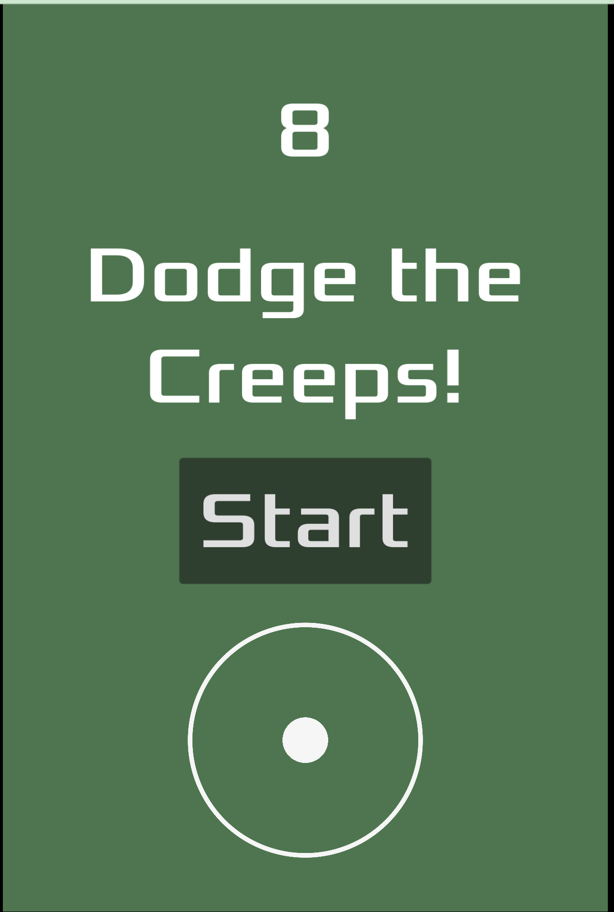
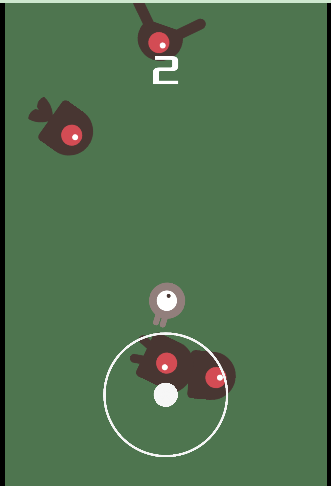

# Dodge the Creeps 2D assets

|  |  |
|---|---|

Play on mobile phone with sounds: https://rioran.github.io/godot-creeps/html/

Used by the "Your first 2D game" tutorial: https://docs.godotengine.org/en/latest/getting_started/first_2d_game/index.html

Upgraded with:

- a mobile stick controller
- player model rotation according to movement direction
- my sounds
- lesser hitbox for both player and mobs.
